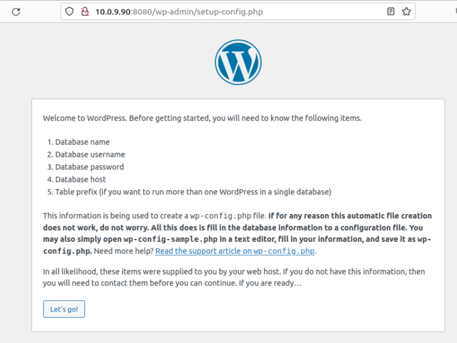

# Tarea4SXE

### En esta practica aprenderemos a instalar y configurar wordpress

#### 1. Utiliza la imagen de Ubuntu , tag 22 y apoyandote en esta guía sigue sus instrucciones para instalar LAMP en dicho contenedor.

##### Lo primero que haremos sera bajar la imagen de ubuntu indicada en el enunciado con el siguiente comando
```
sudo docker pull ubuntu:22.04       #Copiar para bajar la imagen de ubuntu
```

##### Ahora crearemos e iniciaremos el contenedor Para instalar todo lo necesario
```
sudo docker container create -i -t  -p  8080:80 --name WordPress ubuntu:22.04    #Copiar para crear el contenedor

sudo docker container start --attach -i  WordPress        #Copiar para iniaciar el contenedor
```

##### Una vez creado el contenedor seguiremos la guia empezando por actualizar los paquetes
```
sudo apt update    #Copiar para actualizar paquetes
```

##### Instalamos apache2 y lo iniciamos usando el siguiente comando
```
sudo apt install -y apache2 apache2-utils    #Copiar para instalar apache
sudo service apache2 start      #Copiar para iniciar apache
```

##### Instalamos mariaDB y lo iniciamos
```
sudo apt install -y mariadb-server mariadb-client     #Copiar para instalar el servicio de mariDB

service mariadb start     #Copiar para iniciarlo
```

##### Hacemos la instalacion segura de mysql
```
sudo mysql_secure_installation      #Copiar para hacer la instalacion de msql
```

##### Por ultimo instalamos php y lo configuramos en un meno que nos pedira de que region somos
```
sudo apt install -y php php-mysql libapache2-mod-php
```
##### Para comporbar que php funciona pondremos lo siguiente en el navegador
```
http://10.0.9.90/info.php
```
###### Comprobamos que entra


#### 2. Utiliza esta guía para instalar wordpress en el contenedor.

##### Lo primero que debemos hace es descargar curl con el siguiente comando
```
apt-get update && apt-get install -y curl     #Copiar para insalar curl
```

##### A continuacion instalaremos todas las dependencias necesarias para la correcta instalacion de wordpress usand el siguiente comando
```
sudo apt install apache2 \
                 ghostscript \
                 libapache2-mod-php \
                 mysql-server \
                 php \
                 php-bcmath \
                 php-curl \        #Copiar para instalar las dependencas
                 php-imagick \
                 php-intl \
                 php-json \
                 php-mbstring \
                 php-mysql \
                 php-xml \
                 php-zip
```
##### Lo siguiente sera crear el directorio de instalacion y descargar el archivo de instalacion de wordpress, esto lo haremos en un mismo comando aunque son varios por separado
```
sudo mkdir -p /srv/www
sudo chown www-data: /srv/www                                        #Copiar para crear el directorio de instalacion y desargar ela rchivo de instalacion
curl https://wordpress.org/latest.tar.gz | tar zx -C /srv/www
```
##### Crearemos el archivo de configuracion de wordPress para apache
```
nano /etc/apache2/sites-available/wordpress.conf    #Copiar para crear el archivo
```
##### Una vez hecho eso saldra el siguiente editor de texto donde pegaremos el texto de configuracion
```
<VirtualHost *:80>
    DocumentRoot /srv/www/wordpress
    <Directory /srv/www/wordpress>
        Options FollowSymLinks
        AllowOverride Limit Options FileInfo
        DirectoryIndex index.php
        Require all granted
    </Directory>
    <Directory /srv/www/wordpress/wp-content>
        Options FollowSymLinks
        Require all granted
    </Directory>
</VirtualHost>
```


##### A continuacion tendremos que hacer habilitar wordpress Para ello haremos los siguientes comando es orden
```
a2ensite wordpress     #A continuacion con este comando habilitaremos wordpress

sudo a2enmod rewrite      #Con este reescribiremos la url

sudo a2dissite 000-default     #Por ultimo usamos este comando para eliminar la pagina por defecto de wordpress y reiniciamos y recargamos apache2 para aplicar toda la config
service apache2 reload
service apache2 restart
```

##### Despues configuraremos la base de datos, para ello entraremos en mysql cn el siguiente comando
```
mysql -u root
```
##### Una vez hecho eso pondremos la siguiente configuracion
```
CREATE DATABASE wordpress;
CREATE USER 'wordpress'@'localhost' IDENTIFIED BY '<your-password>';
GRANT SELECT, INSERT, UPDATE, DELETE, CREATE, DROP, ALTER ON wordpress.* TO 'wordpress'@'localhost';
FLUSH PRIVILEGES;
QUIT;
                        #Cambiar usuario y cotraseña a eleccion
```
##### Por ultimo pegaremos lo siguiente en el navegador para ver si la instalacion fue correctamente y nos deja acceder a wordpress
```
http://10.0.9.90:8080/wp-admin/setup-config.php
```


##### Una vez dentro de wordpress configuraremos el idioma que queremos para nuestro sitio


##### Creamos un usuario y una contraseña para acceder al sitio y le damos a siguiente


##### Nos pedira que iniciemos sesion para entrar y utilizamos el usuario anteriormente creado


##### Ya estariamos dentro de wordpress


